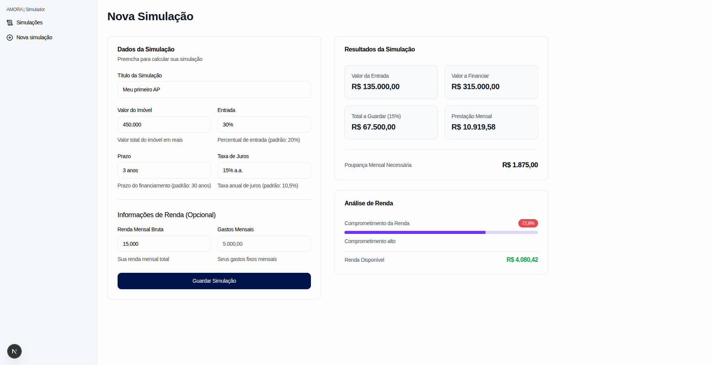
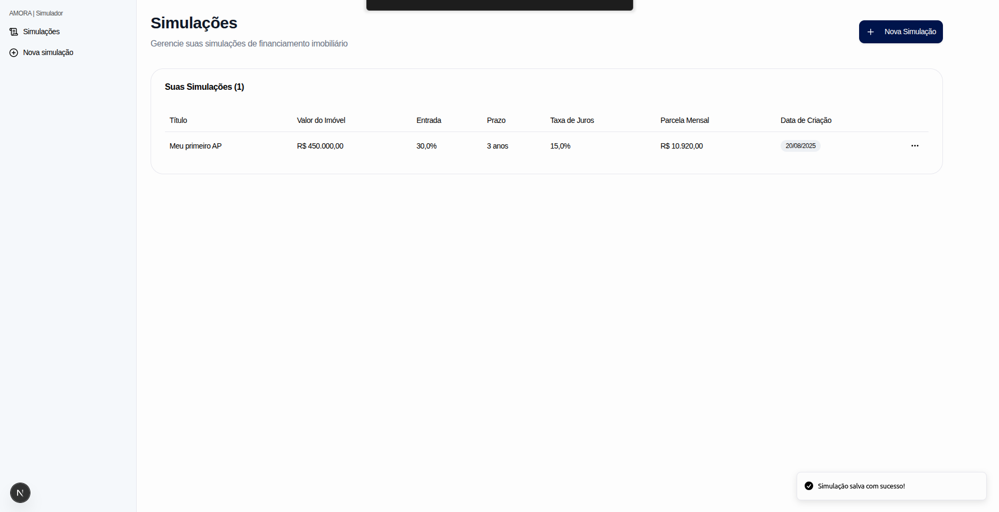

# aMORA simulador de financiamento

> Esse projeto foi desenvolvido como parte do processo seletivo da empresa [aMORA](https://amora.com.br)

## Sumário

- [Requisitos](#requisitos)
- [Instruções para executar o projeto](#instruções-para-executar-o-projeto)
- [Sobre o projeto](#sobre-o-projeto)
- [Estruturas](#estruturas)
- [Uma visão mais profunda sobre o projeto](#uma-visão-mais-profunda-sobre-o-projeto)

## Requisitos

- Node.js v20.0.0 e npm 10.9.2 ou maior
- Bun 1.2.19 ou maior
- Docker 28.3.3 ou maior
- pnpm 10.14.0 ou maior

## Instruções para executar o projeto

São apenas 3 passos simples para a execução do projeto:

### Primeiro
Execute este comando na raiz do projeto:
```bash
cp .env.example .env
```

### Segundo
Rode o comando de instalação de pacotes (esse comando vai instalar todas as dependências necessárias):

```bash
pnpm install
```

> Caso não tenha o gerenciador de pacotes pnpm instalado, instale-o usando o npm:
```bash
npm i -g pnpm 
```

### Execução
Depois basta apenas executar o comando:

```bash
pnpm docker:build && pnpm docker:up
```

## Sobre o projeto

Bom, o projeto em si foi desenvolvido usando monorepo [Turborepo](https://turborepo.com/). Você deve estar se perguntando o porquê eu decidi usar monorepo para o desenvolvimento? 

Bom, principalmente pelo fato de ser na mesma stack e ter o build mais rápido com cache do [Turborepo](https://turborepo.com/), e junto com o pnpm workspace eu consigo ter segurança e velocidade na instalação das dependências. No geral: facilidade no desenvolvimento. Caso eu precisasse que, por exemplo, duas aplicações em apps usassem o mesmo banco de dados, eu simplesmente poderia criar uma pasta chamada `packages/` e dentro dela um pacote chamado `database`. Dessa forma eu poderia compartilhar o ORM [Drizzle](https://orm.drizzle.team/) com ambos os projetos, diminuindo assim a duplicação de código no projeto. 

### API

Para a API eu usei o [Fastify](https://fastify.dev/) como framework backend, [Drizzle](https://orm.drizzle.team/) como ORM e [Better-auth](https://www.better-auth.com/) para autenticação. Dessa forma optei por seguir com o básico, mas com espaço para escalar caso necessário. 

### Web

Para web eu escolhi o [Next.js](https://nextjs.org/) como framework web para criação do simulador. O Next.js tem uma ótima performance e tem um DX razoável, embora eu não tenha gostado muito do conceito de ficar pensando toda hora "será que esse componente é um 'use client' ou não?". Mas no geral ele oferece uma base muito boa para aplicações que precisam de performance e SEO de forma adequada. Para UI eu escolhi o [shadcn/ui](https://ui.shadcn.com/) por ser uma lib de alta qualidade e com componentes pré-construídos, facilitando assim o desenvolvimento. Como ele é baseado no [Tailwind CSS](https://tailwindcss.com/), ele é bastante flexível para fazer alterações e criar um design system adequado. Tambem usei o [Tanstack query](https://tanstack.com/query/latest) para criar uma melhor experiencia ao fazer requests para o backend e gerenciar o ciclo de vida das requests, fazendo com que a UX fique muito melhor.

## Estruturas

Para a API eu segui uma estrutura bastante simples e modular, de forma que não ficasse difícil encontrar o que se precisa na hora do desenvolvimento e para manutenção do projeto.

### API
```
├── app/                          # pasta base para a aplicação
│   ├── database/                 # configuração e migração para o banco de dados
│   │   ├── db.ts                 # client drizzle
│   │   ├── migrations/
│   │   │   ├── 0000_cuddly_tana_nile.sql
│   │   │   ├── 0001_massive_frightful_four.sql
│   │   │   ├── 0002_cooing_silver_samurai.sql
│   │   │   └── meta/
│   │   │       ├── 0000_snapshot.json
│   │   │       ├── 0001_snapshot.json
│   │   │       ├── 0002_snapshot.json
│   │   │       └── _journal.json
│   │   └── schema.ts             # schemas drizzle
│   ├── handlers/                 # funções para manipulação de request/response
│   │   │                         # pode chamar também de 'controller', caso queira
│   │   ├── auth.ts
│   │   └── simulation.ts
│   ├── lib/                      # configuração para bibliotecas externas
│   │   └── auth.ts               # better-auth config
│   ├── routes/                   # rotas da aplicação
│   │   ├── auth.ts
│   │   ├── index.ts
│   │   └── simulation.ts
│   └── server.ts                 # arquivo para iniciar o servidor fastify, junto com suas rotas
├── Dockerfile
├── drizzle.config.ts
├── entrypoint.sh
├── package.json
└── tsconfig.json
```

### WEB
```
├── components.json
├── Dockerfile
├── next.config.js
├── next-env.d.ts
├── package.json
├── postcss.config.mjs
├── public/                     # arquivos estáticos públicos
│   ├── hero-for-register.webp
│   ├── hero-for-sign-in.webp
│   └── logo_amora_blue.svg
├── src/
│   ├── app/                    # App Router do Next.js (páginas e layouts)
│   │   ├── (auth)/             # grupo de rotas para autenticação
│   │   │   ├── _components/
│   │   │   │   ├── form-wrapper.tsx
│   │   │   │   ├── header.tsx
│   │   │   │   ├── layout.tsx
│   │   │   │   ├── sign-in.form.tsx
│   │   │   │   └── sign-up.form.tsx
│   │   │   ├── layout.tsx
│   │   │   ├── sign-in/
│   │   │   │   └── page.tsx
│   │   │   └── sign-up/
│   │   │       └── page.tsx
│   │   ├── favicon.ico
│   │   ├── globals.css
│   │   ├── layout.tsx          # layout raiz da aplicação
│   │   ├── page.tsx
│   │   └── simulation/         # páginas relacionadas às simulações
│   │       ├── create/
│   │       │   ├── _components/
│   │       │   │   ├── empty.state.tsx
│   │       │   │   ├── income.analysis.tsx
│   │       │   │   ├── simulation.form.tsx
│   │       │   │   └── simulation.result.tsx
│   │       │   └── page.tsx
│   │       ├── layout.tsx
│   │       └── list/
│   │           ├── _components/
│   │           │   ├── empty.state.tsx
│   │           │   ├── simulation.table.skeleton.tsx
│   │           │   └── simulation.table.tsx
│   │           └── page.tsx
│   ├── components/             # componentes reutilizáveis da aplicação
│   │   ├── currency-input.tsx
│   │   ├── password-input.tsx
│   │   ├── percentage-input.tsx
│   │   ├── sidebar.tsx
│   │   └── ui/                 # componentes base do shadcn/ui
│   │       ├── alert-dialog.tsx
│   │       ├── badge.tsx
│   │       ├── button.tsx
│   │       ├── card.tsx
│   │       ├── chart.tsx
│   │       ├── dropdown-menu.tsx
│   │       ├── form.tsx
│   │       ├── input.tsx
│   │       ├── label.tsx
│   │       ├── progress.tsx
│   │       ├── separator.tsx
│   │       ├── sheet.tsx
│   │       ├── sidebar.tsx
│   │       ├── skeleton.tsx
│   │       ├── sonner.tsx
│   │       ├── table.tsx
│   │       └── tooltip.tsx
│   ├── hooks/                  # hooks customizados da aplicação
│   │   ├── use-auth.ts
│   │   ├── use-mobile.ts
│   │   └── use-simulations.ts
│   ├── lib/                    # bibliotecas e utilitários
│   │   ├── api.ts
│   │   ├── auth.ts             # configuração do Better-auth no client
│   │   ├── services/
│   │   │   └── simulation.ts
│   │   ├── simulation.test.ts
│   │   ├── simulation.ts       # lógica de cálculo das simulações
│   │   └── utils.ts
│   ├── middleware.ts           # middleware do Next.js para autenticação
│   ├── providers/              # providers do React (context)
│   │   ├── auth.provider.tsx
│   │   └── query.provider.tsx
│   └── schemas/                # schemas de validação com Zod
│       ├── auth.ts
│       └── simulation.ts
└── tsconfig.json
```

## Uma visão mais profunda sobre o projeto

### Decisões técnicas principais

**Monorepo com Turborepo**: Como mencionei antes, escolhi essa abordagem principalmente pela facilidade de desenvolvimento e deploy. Com uma stack única [typescript](https://www.typescriptlang.org/), consegui ter builds mais rápidos e melhor organização do código.

**Fórmulas de cálculo**: Implementei as fórmulas solicitadas no teste, mas também adicionei algumas funcionalidades extras como análise de comprometimento de renda. O simulador calcula:
- Valor da entrada (`valor_imovel * (percentual_entrada / 100)`)
- Valor a financiar (`valor_imovel - valor_entrada`)  
- Total a guardar para custos (`valor_imovel * 0.15`)
- Valor mensal de poupança (`total_a_guardar / (anos_contrato * 12)`)
- Parcela mensal
- Percentual de comprometimento da renda (quando informada)

### Funcionalidades implementadas

Além dos requisitos básicos, implementei algumas funcionalidades extras que considero importantes para a experiência do usuário:

- **Análise de renda**: O usuário pode informar renda e gastos mensais para ver o comprometimento
- **Validação em tempo real**: Feedback imediato nos formulários
- **Design responsivo**: Funciona bem em mobile e desktop
- **Estados de loading**: Skeleton screens enquanto carrega os dados
- **Formatação automática**: Valores em real, percentuais formatados corretamente

### Próximos passos

Se fosse para continuar desenvolvendo esse projeto, algumas funcionalidades que agregaram muito valor seriam:

- **Score de elegibilidade**: Análise automática se o usuário tem perfil para conseguir o financiamento
- **Integração com portais de imóveis**: Importar dados reais de imóveis para comparar
- **Relatórios personalizáveis**: Exportar simulações em PDF ou Excel
- **Comparação de simulações**: Ver lado a lado diferentes cenários
- **Métricas de engajamento**: Entender como os usuários usam o simulador
- **IA**: Eu implementaria uma IA no estilo LLM para responder a quaisquer perguntas logo após a simulação.

### Métricas de sucesso

**Métricas de engajamento:**
- **Taxa de conclusão de simulações**: Percentual de usuários que completam uma simulação após iniciar
- **Número médio de simulações por usuário**: Indica se os usuários estão explorando diferentes cenários
- **Tempo médio gasto na ferramenta**: Mostra o nível de engajamento com a plataforma
- **Taxa de retorno**: Usuários que voltam para fazer novas simulações

**Métricas de conversão:**
- **Taxa de conversão para contato**: Usuários que solicitam contato após fazer simulações
- **Taxa de conversão para contratos**: Simulações que resultam em financiamentos reais
- **Valor médio dos imóveis simulados**: Entender o perfil dos usuários e potencial de negócio

**Métricas de qualidade:**
- **Taxa de simulações com dados de renda**: Indica engagement com funcionalidades avançadas
- **Distribuição de comprometimento de renda**: Entender se estamos atendendo o público-alvo
- **Taxa de abandono por etapa**: Identificar pontos de atrito no fluxo

Essas métricas ajudariam a entender não só se a ferramenta está sendo usada, mas também se está gerando valor real para o negócio da [aMORA](https://amora.com.br).

No geral o projeto esta relativamente bem implementado, eu gostaria de ter tido mais tempo para implementar mais funcionalidades e pensar em edge-cases, mas considero o projeto bem executado. 

### Algumas telas

## Login


## Cadastro


## Simulações


## Criar nova simulação

